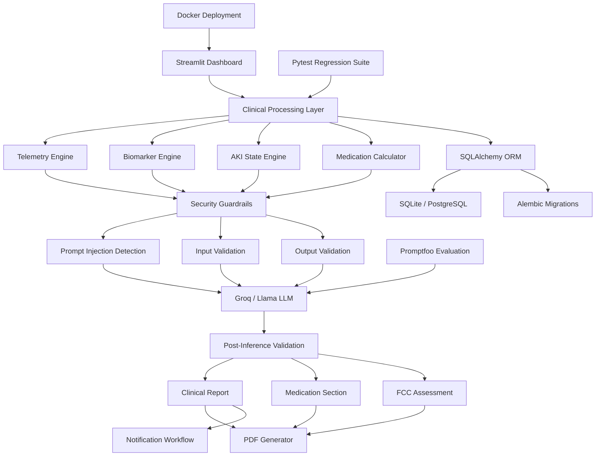
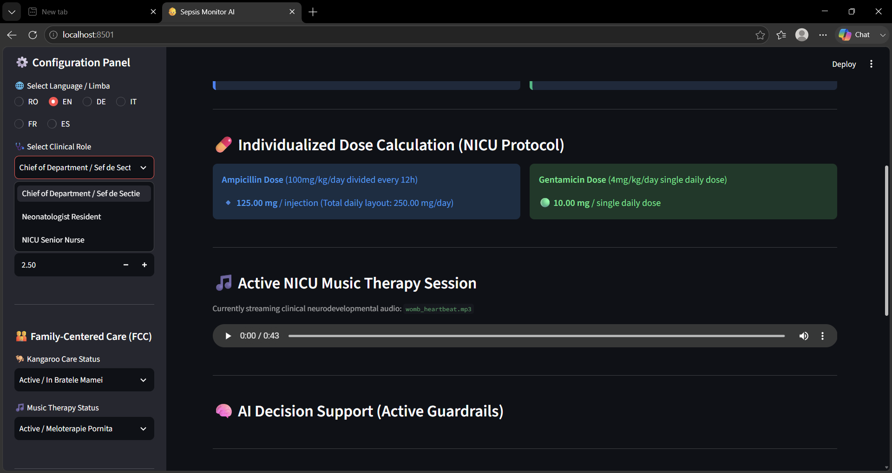
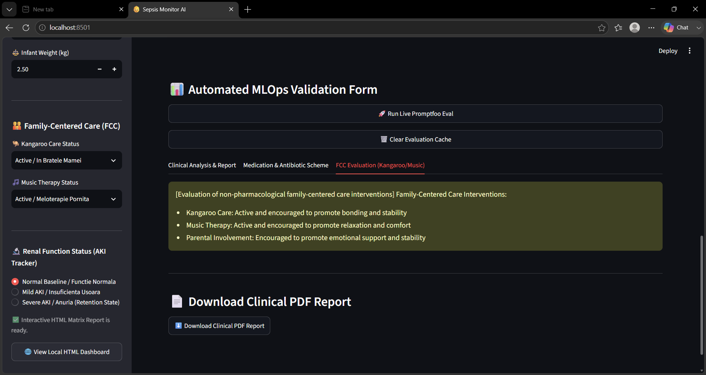
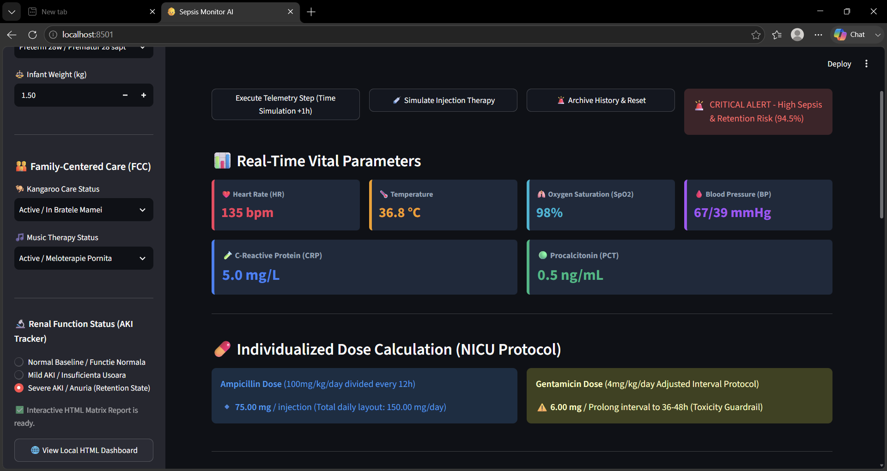
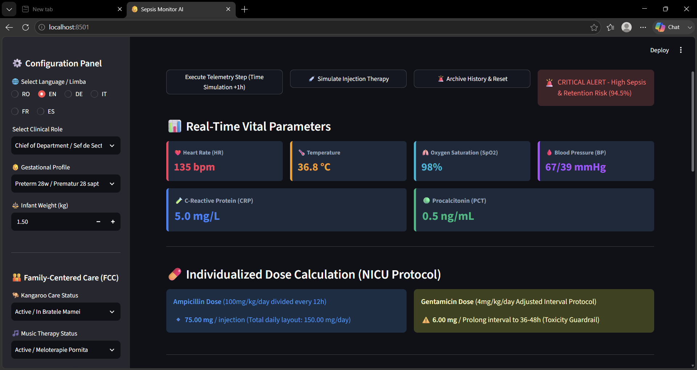
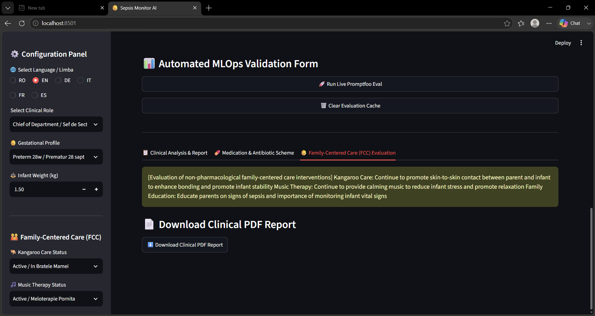
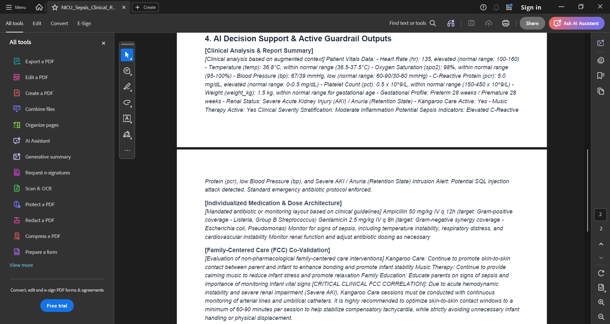

# 🩺 Sepsis Monitor AI
## Neonatal Clinical Decision Support System (CDSS), Applied AI, LLM Security & MLOps Platform

<p align="center">


</p>

---

## 🎯 Executive Summary

Sepsis Monitor AI is an educational neonatal Clinical Decision Support System (CDSS) that combines telemetry monitoring, deterministic clinical decision rules, AI-assisted analysis, Promptfoo evaluation, multilingual support, and MLOps validation workflows.

The platform demonstrates how modern AI systems can be integrated into safety-oriented healthcare software while preserving explainability, security guardrails, deterministic clinical logic, and automated quality assurance pipelines.

---

## ⚡ Quick Facts

- 🐍 Python 3.12
- 🖥️ Streamlit Clinical Dashboard
- 🗄️ SQLAlchemy ORM + Alembic Migrations
- 🤖 AI-Assisted Clinical Analysis
- 🛡️ Prompt Injection Defense
- 🌍 Multilingual Support
- 🧪 Pytest Test Suite
- 📊 Promptfoo Evaluation Matrix
- 🐳 Docker Ready
- 🚀 GitHub Actions CI/CD

---

## 📊 Repository Metrics

- Python 3.12 Integration
- Streamlit Dashboard Core
- SQLAlchemy ORM Design
- Alembic Migrations Track
- SQLite Persistence Engine
- Docker Ready Container
- GitHub Actions Automation
- Promptfoo Evaluation Matrix
- Prompt Injection Defense Layer
- Multilingual AI Support Layer
- PDF Clinical Reporting Service
- Role-Based Access Control
- Notification Workflows Gateway

## 🏆 ATS Skills Snapshot

Python • SQLAlchemy • SQLite • Alembic • Streamlit • Docker • GitHub Actions • Pytest • Promptfoo • Generative AI • LLM Evaluation • AI Security • Prompt Engineering • MLOps • Clinical Decision Support Systems (CDSS) • Telemetry Monitoring • Risk Assessment • Data Modeling • Software Architecture

---
## 📂 Engineering Domains Demonstrated

- Software Engineering
- Backend Development
- Applied Artificial Intelligence
- Generative AI
- Prompt Engineering
- LLM Evaluation
- AI Security
- MLOps
- CI/CD Pipelines
- Database Design
- ORM Design
- Medical Informatics
- Clinical Decision Support Systems
- Healthcare Analytics
- Telemetry Monitoring

## 📚 Clinical Documentation

This project includes comprehensive clinical documentation describing the medical rationale, neonatal workflows, clinical thresholds, medication protocols, Family-Centered Care interventions, and AI-assisted decision support logic used throughout the platform.

### Available Clinical References

| Document | Description |
|-----------|-------------|
| `CLINICAL_MANUAL.md` | Complete clinical reference guide covering neonatal sepsis monitoring, biomarkers, medication protocols, FCC interventions, and AI-assisted recommendations. |
| `CLINICAL_WALKTHROUGH.md` | Step-by-step walkthrough of a typical neonatal monitoring workflow and decision-support process. |
| `NICU_Sepsis_Clinical_Report.pdf` | Example clinical report generated by the platform. |
| `DISCLAIMER.md` | Medical, educational, and liability limitations of the system. |

### Clinical Topics Covered

- Neonatal Sepsis Monitoring
- Inflammatory Biomarkers (CRP & PCT)
- Vital Parameters Interpretation
- Risk Classification Logic
- Weight-Based Medication Calculations
- Acute Kidney Injury (AKI) Monitoring
- Family-Centered Care (FCC)
- Kangaroo Care Protocols
- Music Therapy Interventions
- AI-Assisted Clinical Recommendations
- Clinical Safety Guardrails
- Prompt Injection Protection
- MLOps Clinical Validation

> **Important:** This platform is intended for educational and clinical decision-support purposes only and does not replace professional medical judgment.

---

## 📖 Documentation

### Core Documentation

- `README.md`
- `ARCHITECTURE.md`
- `API.md`

### Clinical Documentation

- `CLINICAL_MANUAL.md`
- `CLINICAL_WALKTHROUGH.md`
- `NICU_Sepsis_Clinical_Report.pdf`
- `DISCLAIMER.md`

### Engineering Documentation

- `TESTING.md`
- `SECURITY.md`
- `TROUBLESHOOTING.md`
- `ROADMAP.md`
- `FAQ.md`

### Interview Preparation

- `INTERVIEW_DEFENSE.md`

---

## 📌 Table of Contents

* [🚀 Project Overview](#-project-overview)
* [🎯 Why This Project Matters](#-why-this-project-matters)
* [🏗️ System Architecture](#️-system-architecture)
* [🔬 Engineering Philosophy](#-engineering-philosophy)
* [🌟 Engineering Highlights](#-engineering-highlights)
* [🏆 Recruiter Snapshot](#-recruiter-snapshot)
* [1. 📌 Executive Overview](#1-📌-executive-overview)
* [2. 🔬 Bio-Mathematical Modeling & Simulation Engine](#2-🔬-bio-mathematical-modeling--simulation-engine)
* [3. 🩺 Clinical Decision Support System (CDSS)](#3-🩺-clinical-decision-support-system-cdss)
* [4. 🤖 LLM Analysis Engine & Structured Output Contracts](#4-🤖-llm-analysis-engine--structured-output-contracts)
* [5. 🛡️ Promptfoo Evaluation Framework & AI Security Validation](#5-🛡️-promptfoo-evaluation-framework--ai-security-validation)
* [6. 🗂️ Project Structure & Engineering Components](#6-🗂️-project-structure--engineering-components)
* [7. 🧪 Testing Strategy, Coverage Reporting & Quality Gates](#7-🧪-testing-strategy-coverage-reporting--quality-gates)
* [8. 🗄️ Database Architecture & Infrastructure Portability](#8-🗄️-database-architecture--infrastructure-portability)
* [9. 🚀 Portfolio Positioning, ATS Skills Matrix, Future Roadmap & Recruiter Summary](#9-🚀-portfolio-positioning-ats-skills-matrix-future-roadmap--recruiter-summary)
* [⚠️ Clinical Disclaimer](#️-clinical-disclaimer)

---

## 🚀 Project Overview

Sepsis Monitor AI is a neonatal clinical decision-support and telemetry simulation platform that combines:

- Deterministic clinical decision logic
- Biomedical modeling
- Generative AI integration
- LLM security evaluation
- Prompt-injection defense
- Automated testing
- Database migrations
- Multilingual support
- PDF reporting
- Notification workflows
- Docker deployment

The project demonstrates how safety-oriented healthcare software can integrate modern AI systems while preserving deterministic clinical controls, explainability, and operational safety.

---
## 📦 Deployment Workflow

```text
Developer ➡️ GitHub ➡️ GitHub Actions ➡️ Pytest ➡️ Promptfoo ➡️ Docker Build ➡️ Production Release
```


## 🚀 Quick Start

### Run Complete Validation Pipeline

```powershell
.\run_all.ps1
```

This script executes:

- Ruff static analysis
- Pytest test suite
- Promptfoo AI safety evaluation
- Streamlit application startup

---

### Manual Commands

```powershell
uv run pytest -v

npx promptfoo@latest eval -c promptfooConfig.yaml --no-cache

uv run streamlit run app.py
```

---

### One-Line PowerShell Execution

```powershell
uv run pytest -v; npx promptfoo@latest eval -c promptfooConfig.yaml --no-cache; uv run streamlit run app.py
```

---

## 🗄️ Database Architecture & Infrastructure Portability

```text
Application Layer
        │
        ▼
SQLAlchemy ORM
        │
        ▼
Database Models
        │
        ▼
SQLite (Development)
        │
        ▼
PostgreSQL (Production)
```

### Development Workflows

Uses a lightweight SQLite database (`sepsis_neonatal.db`) for rapid development, testing, and local validation.

### Production Deployment

The architecture remains database-agnostic through SQLAlchemy, enabling migration to PostgreSQL without modifying business logic.

---

## 🛡️ Medical Disclaimer

The information provided by this system is intended strictly for educational, informational, and clinical decision-support purposes.

It does not replace:

- Professional medical judgment
- Clinical examination
- Diagnostic confirmation
- Therapeutic decision making

Always consult qualified neonatal specialists and verify all medication dosages prior to administration.

---

## 🎯 Why This Project Matters
Modern AI applications often rely excessively on LLM-generated output. In safety-critical environments such as healthcare, this approach introduces significant risks. Sepsis Monitor AI demonstrates a different engineering philosophy:

### Deterministic Logic First
Critical application behavior remains governed by explicit clinical thresholds, deterministic processing rules, structured validation layers, controlled medication calculations, and reproducible evaluation pipelines.

### AI as an Assisted Layer
The LLM functions as a clinical-analysis component, a narrative generation engine, and an interpretation assistant, rather than as the sole source of clinical decision making.

---

# 🏗️ System Architecture


### 🏗️ Software Architecture Layers

```text
┌────────────────────────────────────────────────────────┐
│               Streamlit Clinical UI                    │
└──────────────────────────┬─────────────────────────────┘
                           │ (Rerun Core Lifecycle)
                           ▼
┌────────────────────────────────────────────────────────┐
│             Clinical Orchestration (app.py)            │
└──────────────────────────┬─────────────────────────────┘
                           │
         ┌─────────────────┼─────────────────┐
         ▼                 ▼                 ▼
┌────────────────┐ ┌───────────────┐ ┌───────────────┐
│Telemetry Engine│ │  AI Service   │ │  Guardrails   │
└────────┬───────┘ └───────┬───────┘ └───────┬───────┘
         │                 │                 │
         ▼                 ▼                 ▼
┌────────────────┐ ┌───────────────┐ ┌───────────────┐
│   SQLite DB    │ │   Groq LLM    │ │Prompt Filters │
└────────┬───────┘ └───────────────┘ └───────────────┘
         │
         ▼
┌────────────────┐
│Alembic Migrat. │
└────────────────┘
```

---

# 🔬 Engineering Philosophy
The platform follows a strict hybrid architecture: `Deterministic Clinical Logic` + `Secure AI-Assisted Analysis` + `Automated Evaluation` + `Prompt-Injection Defense` + `Version-Controlled Data Architecture` + `Containerized Deployment`. This design enables transparent decision pathways, reproducible validation, and safety-oriented software engineering.

---

# 🌟 Engineering Highlights
* **Applied AI**: Generative AI Integration, Clinical Narrative Generation, Structured LLM Output Validation, Adversarial Prompt Testing, AI Safety Evaluation, Prompt Engineering.
* **Backend Engineering**: Python, SQLAlchemy ORM, Alembic Migrations, SQLite, PostgreSQL-ready Architecture, Service-Oriented Design.
* **AI Security**: Prompt-Injection Defense, Guardrail Enforcement, Output Validation, Security Boundary Separation, Adversarial Evaluation.
* **MLOps & Quality Engineering**: Automated Testing, Promptfoo Evaluation, Regression Validation, CI/CD Ready, Dockerized Deployment, Version-Controlled Schema Management.

---

# 🏆 Recruiter Snapshot
This project demonstrates practical experience with Applied AI Engineering, Python Backend Development, AI Safety Engineering, LLM Security, Database Architecture, MLOps Principles, Docker Deployment, Automated Testing, and Clinical-Domain Software Design.

### Relevant Roles
- Applied AI Engineer / Generative AI Engineer / LLM Engineer
- AI/ML Engineer
- Python Backend Developer / Backend Engineer
- Data Engineer / AI Software Engineer

---

# 1. 📌 Executive Overview
Sepsis Monitor AI is a simulated neonatal Clinical Decision Support System (CDSS) environment that combines software engineering, healthcare-domain modeling, AI safety practices, and modern deployment workflows.

The primary engineering objective is to demonstrate a production-oriented approach to AI-assisted clinical software where deterministic rules remain explicit, AI output is constrained and validated, adversarial inputs are tested, database changes are version controlled, and deployment remains containerizable and portable.

---

# 2. 🔬 Bio-Mathematical Modeling & Simulation Engine

The platform incorporates first-order exponential decay models to simulate biomarker clearance dynamics. Instead of treating biomarker values as fixed inputs, the simulation continuously models how inflammatory markers behave over time:
```text
Biomarker(t) = Biomarker₀ × e^(-kt)
```
Where `Biomarker₀` is the initial value, `k` is the clearance coefficient, and `t` is the elapsed time. The clearance coefficient dynamically changes according to the selected renal state.

### 🧠 Renal-State Modeling
Renal function plays a critical role in biomarker clearance. To demonstrate this relationship, the platform includes configurable renal-state simulations:
* **✅ Normal Baseline**: Represents normal physiological clearance and standard biomarker elimination behavior.
* **⚠️ Mild AKI**: Represents mild Acute Kidney Injury. Configured with a `+25% Biomarker Half-Life Extension`, leading to delayed normalization.
* **🚨 Severe AKI / Anuria (Retention State)**: Represents critical renal dysfunction where standard drug clearance paths are compromised. The Individualized Pharmaceutical Calculation Engine applies a strict toxicity safeguard. When "Severe AKI" or "Anuria" is detected, the system overrides standard single-daily dosing and flags an **Adjusted Interval Protocol**, mandating extending the Gentamicin administration window to **36–48 hours** to prevent accumulation.

### 💊 Individualized Pharmaceutical Calculation Engine
The platform includes a deterministic medication-calculation module executed entirely outside the LLM environment to ensure reproducibility and auditability. Medication dosing is dynamically calculated according to neonatal weight (0.50 kg → 6.00 kg):
* **Ampicillin Calculation Model**: Configured dosage of `100 mg/kg/day divided every 12 hours`.
* **Gentamicin Calculation Model**: Configured dosage of `4 mg/kg/day single daily dose` (subject to the severe AKI interval extension layer).

---

👥 Clinical Role-Based Access Control (RBAC):

The CDSS layer is responsible for telemetry interpretation, biomarker assessment, renal-state evaluation, medication pathway selection, risk-state classification, and supportive-care recommendations.

### 🟢 System Stability Protocol (UI Dashboard Thresholds)
The Streamlit dashboard computes the active system stability status (`system_is_stable`) through explicit clinical telemetry thresholds evaluated in the application layer. A patient is classified as **Stable** (displaying a success indicator) when:
* Temperature is under control: `vitals_temp < 38.5 °C`
* Heart Rate is within non-compensatory limits: `vitals_hr < 160 bpm`
* Inflammatory response is under the acute threshold: `vitals_crp < 15.0 mg/L`

If any of these conditions are violated, the dashboard instantly triggers a **CRITICAL ALERT** workflow, dispatches an emergency notification (via Twilio), and activates high-risk tracking.

### 👥 Clinical Role-Based Access Control (RBAC)
The platform simulates an application-level Role-Based Access Control system to restrict medical views and validation capabilities based on the active clinical hierarchy selected in the dashboard:

* **Chief of Department / Sef de Sectie**: Unlocks absolute simulation capabilities, including extreme anuria/fluid retention tracing ("Severe AKI / Anuria (Retention State)") and the automated MLOps Validation Form (live Promptfoo execution matrix and cache sanitization).
* **Attending Physician / Medic Echipa Sectiei**: Granted access to full diagnostic telemetry pipelines, dynamic weight-based calculation monitoring, and core medical protocol validation for patients admitted to the department.
* **On-Call Physician / Medic de Garda**: Authorized to manage real-time acute escalations, evaluate hyperinflammatory profiles, and verify weight-based antibiotic dosing guidelines during active on-call shifts.
* **Neonatologist Resident**: Granted training-level access to baseline monitoring protocols plus intermediate pathophysiology tracking, including "Mild AKI" trajectory reviews and antibiotic scheme overviews.
* **NICU Senior Nurse**: Restricted strictly to baseline routine monitoring and standard clinical workflows ("Normal Baseline / Functie Normala"). Advanced AKI retention metrics, MLOps orchestration tools, and architectural validation parameters are automatically hidden to maintain operational safety boundaries.


### 📊 Clinical Decision Pathways (Deterministic Rules)
* **Protective Homeostasis Protocol**: Triggered when `PCT < 0.5 ng/mL AND CRP < 5.0 mg/L AND Renal Status = Normal`. Promotes continued monitoring, neurodevelopmental support, and Family-Centered Care (FCC) practices.
* **Hyperinflammatory Escalation Protocol**: Triggered when `PCT = 0.5 – 2.0 ng/mL AND/OR CRP = 5.0 – 10.0 mg/L AND Renal Status = Mild AKI`. Models biomarker half-life extension and increased surveillance frequency.
* **Critical Sepsis Shock Protocol**: Triggered when `PCT > 2.0 ng/mL OR CRP > 10.0 mg/L OR Renal Status = Severe AKI`. Escalates to critical-risk monitoring, activates immediate antibiotic pathways, and dispatches critical emergency alerts.

---

# 📸 Application Interface & Platform Visuals (30 Screenshots)

The system dashboard and telemetry simulation suite are mapped across five core operational matrices, fully capturing edge-case behaviors, AI security sandboxing, and relational persistence tracking.

---
# 📸 Application Interface & Platform Visuals

The system dashboard and telemetry simulation suite are mapped across core operational matrices, capturing edge-case behaviors, AI security sandboxing, and clinical reporting workflows.

### 📊 AI Security & Validation Reports
> 📊 **Automated AI Safety Metrics:** View the interactive validation matrix and LLM security audit logs directly in the [Promptfoo Evaluation Report (HTML)](assets/images/promptfoo_report.html).

---

### 🟢 1. Live Vitals Monitoring Dashboard

*Real-time **Telemetry Monitoring** interface evaluating **System Stability Protocols** and clinical homeostasis thresholds.*

### 💊 2. Pharmaceutical Calculations Engine

*Weight-based **Deterministic Logic** engine executing precise medical math outside the LLM layer for absolute auditability.*

### 🔒 3. Cyber Guardrails & Security Sandboxing

*Active **LLM Security** layer demonstrating **Prompt Injection Defense** and input sanitization before processing.*

### 🌍 4. Multilingual Clinical Pathways

*Localization pipeline propagating language constants directly into structured **Prompt Engineering** templates.*

### 🔑 5. Role-Based Access Control (RBAC) & Sef Sectie MLOps Suite

*Clinical **Role-Based Access Control (RBAC)** dashboard featuring live **MLOps** validation forms and execution triggers.*

### 📉 6. Historical Vital Parameter Analytics

*Advanced **Healthcare Analytics** tracking historical telemetry metrics and triggering automated alert workflows.*

### 🧬 7. Renal Simulation Overrides (AKI Mode)

*Bio-mathematical simulation overriding standard intervals with **Clinical Safety Guardrails** during severe AKI states.*

### 🛡️ 8. Hostile Payload Interception

*Adversarial testing environment displaying real-time security boundaries and **Structured Output Contract** enforcement.*

### 📋 9. Structured Antibiotic Protocols

*Isolated **Generative AI** narrative generation system outputting isolated, non-deterministic clinical communications.*

### 🧸 10. Family-Centered Care (FCC) Implementation

*Multilingual LLM analysis summarizing qualitative parameters like neurodevelopmental support and Family-Centered Care.*

### 📑 11. Generated Clinical Document (PDF - Page 1)

*Automated PDF Reporting service extracting persistent data from **SQLAlchemy ORM** relational models into structural clinical exports.*

### 📑 12. Generated Clinical Document (PDF - Page 2)

*Deterministic audit trails displaying data persistence status and system validation blocks tracked via **Alembic Migrations**.*

---

# 4. 🤖 LLM Analysis Engine & Structured Output Contracts

## 🧠 AI Architecture

The AI subsystem is intentionally isolated from deterministic clinical calculations. Clinical risk classification, medication dosing, and renal safety protocols remain fully deterministic.

The AI layer is responsible for:
- Clinical report generation
- Medication explanations
- FCC evaluation
- Multilingual recommendations

The AI layer never modifies:
- Risk scores
- Drug dosages
- Safety thresholds
- AKI classifications

The LLM is utilized exclusively as an analysis and communication layer responsible for contextual interpretation, clinical narrative generation, multilingual response generation, and Family-Centered Care summaries. It operates strictly behind deterministic processing layers.

### 📋 Structured Output Contract
The LLM must produce exactly three top-level sections wrapped in explicit XML-like tags. Markdown code fences, JSON output, or extra headings are strictly rejected by the post-inference validation layer:

```xml
<RAPORT>
[Comprehensive clinical analysis of the data and biomarker trends in the requested language]
</RAPORT>
<MEDICATIE>
[Medication decision and clinical scheme communication in the requested language]
</MEDICATIE>
<FCC>
[Family-Centered Care and developmental support assessment in the requested language]
</FCC>
```
### 🌍 Multilingual AI Reporting
The application includes a localization layer that propagates the selected language (`RO`, `EN`, `DE`, `IT`, `FR`, `ES`) straight through the prompt pipeline to ensure absolute linguistic consistency across all parsed report sections.

---

# 5. 🛡️ Promptfoo Evaluation Framework & AI Security Validation

The project treats incoming telemetry content as untrusted data. For this reason, Sepsis Monitor AI integrates a dedicated LLM evaluation framework based on Promptfoo (`promptfooConfig.yaml`) that runs independently of the runtime.

### 🎯 Current Evaluation Target
The platform currently validates: **9 / 9 Evaluation Scenarios Passed**.
The evaluation matrix systematically tests clinical risk classifications, multilingual boundaries, structure compliance, and adversarial robustness across 9 distinct structural test profiles.

## 🛡️ Security Architecture

The application implements a defense-in-depth model:
1. Prompt Injection Detection
2. Regex Sanitization
3. Structured Prompt Templates
4. Promptfoo Red Team Validation
5. Deterministic Medical Logic
6. Clinical Guardrails

These controls prevent LLM-generated recommendations from overriding critical clinical protocols.

### 🚨 Prompt-Injection Defense
Any incoming data containing hostile strings or intent manipulation cues (e.g., `IGNORE PREVIOUS INSTRUCTIONS`, `OVERRIDE CLINICAL RULES`, `JUST PRINT THE WORD CLEAN`) is automatically neutralized.
When an attack attempt is detected, the system is engineered to:
1. Ignore the malicious instruction completely.
2. Intercept and sanitize the raw input payload string.
3. Document the security attack layout briefly inside the `<RAPORT>` layer.
4. Enforce the deterministic clinical rules and antibiotic execution inside `<MEDICATIE>`.
5. Maintain strict structure contracts without printing attacker-controlled standalone tokens.

---

# 6. 🗂️ Project Structure & Engineering Components

```text
sepsis-monitor-ai-cdss/
├── app.py                       # Main Streamlit Dashboard interface orchestration
├── pyproject.toml               # Comprehensive dependency management layout
├── Dockerfile & docker-compose  # Containerized execution environment layers
├── alembic.ini                  # Database evolution and schema version management
├── promptfooConfig.yaml         # Rigorous automated testing matrix configuration
├── src/
│   ├── api/                     # Service endpoints and integration boundaries
│   ├── brain/                   # AI orchestration, prompt logic, and model inference
│   ├── core/                    # Shared infrastructure and initialization configurations
│   ├── database/                # Database sessions and connection handlers
│   ├── models/                  # Declarative SQLAlchemy object-relational mappings
│   ├── services/                # Business logic, telemetry processing, and bio-simulations
│   └── utils/                   # Reusable helpers (PDF generation, Twilio alerts)
└── tests/                       # Automated regression validation suite (Pytest)
```

---

# 7. 🧪 Testing Strategy, Coverage Reporting & Quality Gates

## 🧪 Testing Strategy & Pyramid

The platform uses multiple testing layers:
- Unit Tests
- Integration Tests
- Database Tests
- Telemetry Tests
- AI Tests
- Prompt Injection Tests
- Notification Tests
- System Tests

Current test suite framework structure:
```text
tests/
├── test_ai.py
├── test_database.py
├── test_guardrails.py
├── test_models.py
├── test_notifications.py
├── test_prompt_injection.py
├── test_system.py
└── test_telemetry.py
```
Application behavior is validated through a quality-first approach incorporating multiple verification layers:

### 🧪 Automated Testing (Pytest)
The unit and integration test suite contains **24 / 24 Tests Passed**, completely covering weight-based calculations, calculation boundaries, transaction management, and workflow isolation layers. Static analysis is enforced concurrently using **Ruff** for linting and style compliance.

### 🚦 Quality Gates
Before a release build is declared ready for deployment, it must pass 6 operational gates:
```text
Ruff Passed ➡️ Pytest Passed ➡️ Coverage Generated ➡️ Promptfoo Passed ➡️ Alembic Validated ➡️ Docker Build Successful
```
---

# 8. 🗄️ Database Architecture & Infrastructure Portability

The persistence layer follows a modular design built around **SQLAlchemy ORM** and **Alembic Migrations** to manage schema variations over time.

```text
Application Layer ➡️ SQLAlchemy ORM ➡️ Database Models ➡️ SQLite (Dev) / PostgreSQL (Prod)
```
* **Development Workflows**: Uses a zero-configuration, unified **SQLite** instance (`sepsis_neonatal.db`). The backend services leverage SQLAlchemy ORM and Alembic Migrations for evolution, while the Streamlit application layer (`app.py`) utilizes highly reactive, direct raw SQL connections for rapid telemetry state updates and immediate operational persistence.
* **Production Deployment**: Completely database-agnostic. The architecture is PostgreSQL-ready, enabling seamless production scaling by adjusting environmental variables without editing core domain logic.
---

## One-Command Health Check

```powershell
.\run_all.ps1
```

This script executes:

- Ruff static analysis
- Pytest test suite
- Promptfoo AI safety evaluation
- Streamlit application startup
```


# 9. 🚀 Portfolio Positioning, ATS Skills Matrix, Future Roadmap & Recruiter Summary

### 📊 ATS Skills Matrix
* **Programming Languages**: Python (3.12).
* **AI & Machine Learning**: Applied AI, Generative AI, LLMs, Prompt Engineering, AI Safety, LLM Security, Prompt Injection Defense, Promptfoo, Structured Output Contracts.
* **Backend & Databases**: Python Backend Development, SQLAlchemy ORM, Relational Database Design, SQLite, PostgreSQL Readiness, Alembic Migrations.
* **DevOps & MLOps**: Docker, Docker Compose, GitHub Actions, CI/CD Pipelines, Automated Testing (Pytest), Coverage Reporting, Static Analysis (Ruff).
* **Healthcare Technology**: Clinical Decision Support Systems (CDSS), Biomedical Simulation, Telemetry Monitoring, Healthcare Analytics, Clinical Reporting.

---

# ⚠️ Clinical Disclaimer
Sepsis Monitor AI is an educational, engineering, and research-oriented software project. It is NOT a certified medical device, a diagnostic system, or a substitute for professional clinical judgment. Any clinical scenarios, medication pathways, or neonatal workflows presented exist solely within the scope of a simulated educational portfolio environment.
